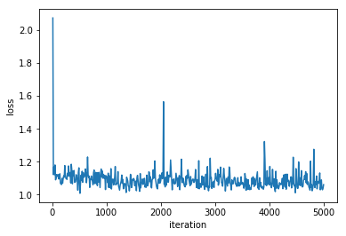
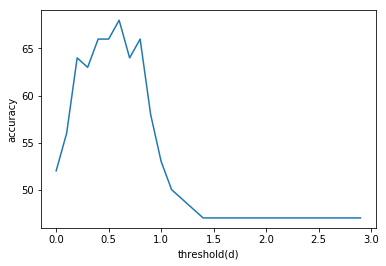

# Offline Signature Verification using Siamese Convolutional Neural Networks in Pytorch

# Steps to produce the results
1) Git clone the repository
2) Run SignatureVerificatin.py file

# Loss

# Accuracy

# Architecture
[Siamese convolutional Neural Network](https://www.cs.cmu.edu/~rsalakhu/papers/oneshot1.pdf) is used.

Dataset provided : Pair of images ( genuine- genuine / genuine - forge)

Custom Dataloader using Dataloader in pytorch.

# Above results are for
Iteration : 500

Batch Size : 180

Resized image to 150 * 150 because of Processing time and memory limitations

English signature datasets.

# System
These experiments were ran on 24GB RAM and Core i5 8th gen with Nvidia.

# List of experiments you can perform using this code.
Increase the dataset size and Iterations.

Check for other accuracy measures to appropriately determine the model consistency.

Try running for different language datasets.

# References
[Siamese convolutional Neural Networks](https://www.cs.cmu.edu/~rsalakhu/papers/oneshot1.pdf)

[SigNet](https://arxiv.org/abs/1707.02131)

[Dimensionality Reduction by learning an invariant mapping](http://yann.lecun.com/exdb/publis/pdf/hadsell-chopra-lecun-06.pdf)
